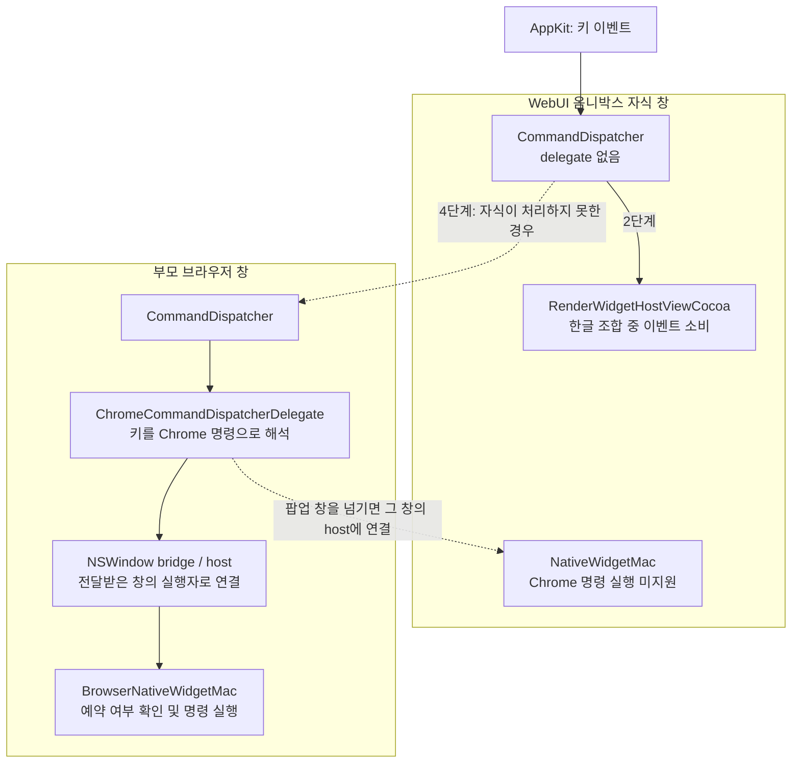
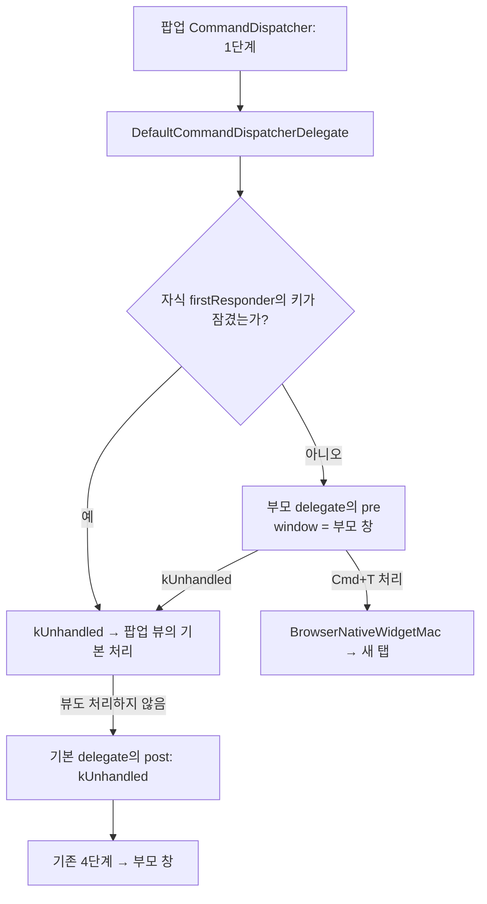

macOS의 WebUI 옴니박스 팝업에서 한글 조합 중 첫 번째 `Cmd+T`가 무시되는 문제를 수정했습니다. 자식 창에서 빠져 있던 단축키 선처리를 부모 브라우저 창으로 연결하는 작업입니다. 처음에는 `CommandDispatcher` 내부를 수정했고, 최종적으로는 **부모에게 선처리를 전달하는 기본 delegate**를 새로 만들었습니다.

## 문제 발견 경로

[crbug.com/556432989](https://crbug.com/556432989)의 증상을 `WebUIOmniboxPopup`, `WebUIOmniboxFullPopup`을 활성화한 macOS Chromium에서 재현했습니다.

- 옴니박스에서 한글을 확정하지 않은 조합 상태로 두고 `Cmd+T`를 누르면 새 탭이 열리지 않았습니다. 두 번째로 눌러야 동작했습니다.
- 영문 입력과 한글 조합 상태를 비교하고, 팝업 창의 키 이벤트가 브라우저 창에 도달하는 경로를 추적했습니다.
- FullPopup은 입력 행까지 WebUI로 구성하며, 키보드 포커스를 받는 별도 자식 창입니다. 이 창의 `CommandDispatcher`에 Chrome 단축키를 처리할 delegate가 없다는 점을 확인했습니다.

## 문제 발생 원인

`CommandDispatcher`는 단축키를 다음 순서로 전달합니다. `firstResponder`는 해당 창에서 키보드 포커스를 가진 응답자입니다.

| 단계 | 처리 대상 | 역할 |
| --- | --- | --- |
| 1. `pre` | 창의 delegate | 예약 명령과 고우선순위 단축키를 포커스된 뷰보다 먼저 처리 |
| 2. 기본 처리 | 포커스된 뷰 | 입력 필드나 웹 콘텐츠에 이벤트 전달 |
| 3. `post` | 창의 delegate | 뷰가 처리하지 않은 나머지 명령 처리 |
| 4. 부모 전달 | `commandDispatchParent` | 자식에서 처리하지 못한 이벤트를 부모 창으로 전달 |

`Cmd+T`는 예약 명령이므로 1단계에서 실행되어야 합니다. 하지만 팝업에는 delegate가 없어 선처리가 건너뛰어졌고, 2단계의 `RenderWidgetHostViewCocoa`가 이벤트를 렌더러로 넘겼습니다. 한글 조합 중에는 입력 처리 경로가 이를 소비해 부모에게 돌아오지 않았습니다.

즉, **부모에게 전달하는 경로는 있었지만 포커스된 뷰보다 뒤에 있었습니다.** 첫 입력으로 조합이 끝난 뒤에는 다음 단축키가 부모까지 도달하므로 두 번째 누름만 동작했습니다.

## 이해를 위한 아키텍처와 의존 관계

`CommandDispatcher`는 전달 순서를 관리하고, `CommandDispatcherDelegate` 프로토콜을 통해 선·후처리를 맡깁니다. Chrome 명령 해석은 `ChromeCommandDispatcherDelegate`, 예약 여부 확인과 실제 실행은 브라우저 창의 `BrowserNativeWidgetMac` 쪽에서 담당합니다.

아래는 **수정 전** 구조입니다. 화살표는 이벤트 전달 및 객체 연결 관계를 나타냅니다.

delegate가 받는 `window` 인자가 어떤 실행자에 연결되는지가 중요합니다. 브라우저 창이면 명령을 실행할 수 있지만, 범용 팝업 창의 `NativeWidgetMac`은 Chrome 명령을 실행하지 못합니다.

## 해결 내용

### 사전 시도: 기존 Chrome delegate를 팝업에 설치

팝업에도 `ChromeCommandDispatcherDelegate`를 설치하고, `pre`에서 부모 실행자로 재시도하도록 했습니다. `Cmd+T` 증상은 해결됐지만, 같은 delegate의 `post`까지 팝업에서 실행되는 회귀가 생겼습니다.

메뉴에 없는 `Cmd+1` 같은 명령이 팝업의 host로 전달되면 실행에 실패했습니다. 디버그 빌드에서는 `DCHECK(was_executed)`로 크래시하고, 릴리스에서는 실패해도 `kHandled`를 반환해 단축키가 무시되는 구조였습니다. 실제 크래시 스택에서도 이 경로를 확인해 해당 접근을 폐기했습니다.

### 1차: 기존 CommandDispatcher의 선처리 경로 수정

`performKeyEquivalent:`가 자기 delegate만 호출하던 부분을 `bubbleUpPrePerformKeyEquivalent:`로 바꿨습니다. delegate가 없으면 `commandDispatchParent`를 따라 부모의 `pre`를 호출하는 방식입니다.

이로써 명령 판단과 실행은 부모 브라우저에 두고, 팝업의 2·3·4단계는 유지할 수 있었습니다. 다만 부모의 `pre`는 부모 창의 포커스만 검사하므로, **자식 뷰의 Keyboard Lock이 우회되는 회귀**를 발견했습니다. 부모에게 위임하기 전에 자식 `firstResponder`의 `isKeyLocked:`를 확인하도록 보완했습니다.

### 2차: DefaultCommandDispatcherDelegate 생성 — 최종 반영

최종안에서는 부모로 전달하는 동작을 `ui/base/cocoa/default_command_dispatcher_delegate.{h,mm}`에 분리했습니다. `CommandDispatcher`의 기존 처리 순서를 유지하면서 delegate 확장 지점으로 필요한 동작을 제공하는 구조입니다. [병합된 CL](https://chromium-review.googlesource.com/c/chromium/src/+/8350946)

1. 모든 `NativeWidgetMacNSWindow`에 기본 delegate를 설치하고, 창이 이를 강한 참조로 보관합니다. 브라우저 창은 기존처럼 Chrome 전용 delegate로 교체합니다.
2. 기본 delegate의 `pre`는 **자기 창의 Keyboard Lock을 먼저 확인**합니다. 잠긴 키는 `kUnhandled`로 돌려보내 뷰가 처리하도록 합니다.
3. 창이 `CommandDispatchingWindow`를 따르는지 확인한 뒤, `commandDispatchParent`의 delegate에 부모 창을 인자로 전달합니다. 기존 부모 선택 조건과 전체화면의 부모 override도 그대로 사용합니다.
4. 기본 delegate의 `post`는 항상 `kUnhandled`를 반환합니다. 팝업에서 Chrome 명령을 실행하려 하지 않고, 기존 4단계로 부모에게 넘깁니다.
5. 새 파일을 `ui/base/BUILD.gn`의 macOS 소스 목록에 등록했습니다. `CommandDispatcher` 본체는 delegate 설치에 관한 주석만 갱신했습니다.

핵심 차이는 **팝업에 Chrome 명령 실행용 delegate를 붙이는 대신, 선처리 전달만 담당하는 delegate를 붙였다**는 점입니다. 1차안의 부모 위임 동작과 Keyboard Lock 보호를 유지하면서, 사전 시도의 `post` 회귀를 피했습니다.

부모가 선처리를 거절한 이벤트는 이후 4단계에서 부모의 `pre`를 다시 거칠 수 있습니다. 최종 CL 설명에도 이 중복을 명시했습니다. 또한 선처리 전체를 전달하므로 고우선순위 액셀러레이터의 순서에도 영향을 줍니다. 한글 조합 중 `Cmd+1`, `Cmd+L` 같은 비예약 명령의 첫 누름이 소비되는 문제는 별도 범위로 남았습니다.

## 테스트 방법

최종 패치에는 다음 회귀 테스트가 포함됐습니다.

| 테스트 | 확인 내용 |
| --- | --- |
| `PreFirstResponderStageRunsOnDispatchParent` | 부모가 선처리한 키는 자식 뷰에 도달하지 않음 |
| `DispatchParentDecliningLeavesFirstResponder` | 부모가 거절한 키는 자식 뷰에 전달됨 |
| `DispatchParentStageHonorsKeyLock` | 자식의 Keyboard Lock을 부모 선처리가 앞지르지 않음 |
| `ChildWindowKeyEquivalentDispatch` | 실제 브라우저에서 `Cmd+T`로 탭이 열리고, 비예약 `Cmd+L`은 자식 뷰에 전달됨 |

인터랙티브 테스트는 실제 한글 입력기 대신 이벤트를 소비하는 spy 뷰로 조건을 재현합니다. 반환값은 수정 전후 모두 `YES`일 수 있으므로, **탭 개수 증가와 뷰의 이벤트 수신 여부**를 함께 검사합니다.

제공된 작업 기록의 1차안 검증 결과는 유닛 6/6, 인터랙티브 1/1, 수동 6항목 통과입니다. Keyboard Lock 보호를 제거했을 때 테스트가 실제로 실패하는 것도 확인했습니다. 이 수치는 최종 delegate 전환 이후의 재실행 결과와 구분합니다.

## 배운 점

- **호출을 추가할 때는 최종 실행자까지 추적해야 합니다.** delegate 설치만 확인하면 같은 객체의 `post`가 어떤 host를 호출하는지 놓칠 수 있습니다.
- **입력 소유자와 명령 실행자는 다를 수 있습니다.** Keyboard Lock은 자식 창에서 확인하고, Chrome 명령 실행은 부모 창에 맡겨야 합니다.
- **기존 확장 지점을 활용하면 책임을 분리할 수 있습니다.** 순서 관리자의 내부 로직을 바꾸는 1차안에서, 부모 전달을 담당하는 기본 delegate를 제공하는 최종안으로 정리했습니다.
- **테스트 통과와 버그 검출은 다릅니다.** 실제 부수 효과를 검증하고, 수정 제거 시 실패하는지 확인해야 회귀 테스트의 판별력을 알 수 있습니다.
- 크래시 분석에서는 프로세스 시작 시각과 로드된 바이너리를 확인해야 합니다. 디스크에 새 빌드가 있어도 실행 중인 프로세스는 이전 빌드일 수 있습니다.

## 참고 자료

- [문제 이슈: crbug.com/556432989](https://crbug.com/556432989)
- [최종 CL: 8350946](https://chromium-review.googlesource.com/c/chromium/src/+/8350946)
- [최종 기본 delegate 구현](https://chromium.googlesource.com/chromium/src/+/b43f1a7f4665e08050ba4e3c695cce734656defc/ui/base/cocoa/default_command_dispatcher_delegate.mm)
- [CommandDispatcher 계약과 프로토콜](https://chromium.googlesource.com/chromium/src/+/b43f1a7f4665e08050ba4e3c695cce734656defc/ui/base/cocoa/command_dispatcher.h)
- [NativeWidgetMacNSWindow의 delegate 설치](https://chromium.googlesource.com/chromium/src/+/b43f1a7f4665e08050ba4e3c695cce734656defc/components/remote_cocoa/app_shim/native_widget_mac_nswindow.mm)
- [관련 FullPopup 단축키 이슈: crbug.com/450817273](https://crbug.com/450817273)
